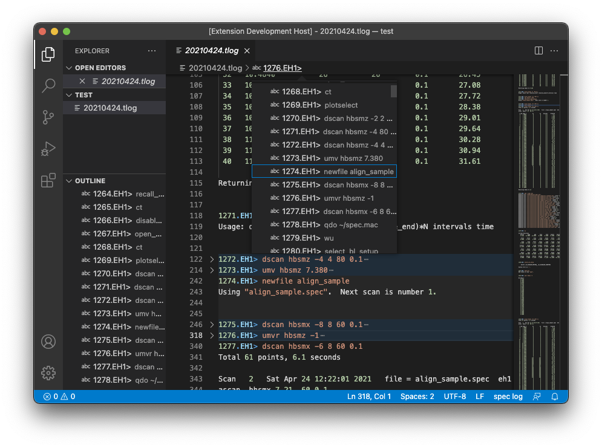

# __spec__ Log File Extension for Visual Studio Code

The extension enhances user experiences in browsing __spec__ log files with Visual Studio Code.
The term _log files_ here indicates files created when __spec__ software is launched with `-l` option (e.g., `fourc -l 20210414.tlog`).

__spec__ does not specify the filename extension of log files.
While this VS Code extension by default treats `.tlog` as the file extension of log files (language identifier: `spec-log`), users can change the association by themselves.
Read [Language Support in Visual Studio Code](https://code.visualstudio.com/docs/languages/overview) (official document of VS Code) for further details.

## What's __spec__?

> __spec__ is internationally recognized as the leading software for instrument control and data acquisition in X-ray diffraction experiments.
> It is used at more than 200 synchrotrons, industrial laboratories, universities and research facilities around the globe.

_cited from [CSS - Certified Scientific Software](https://www.certif.com) homepage._

Note that the extension is not the official one developed by Certified Scientific Software.
Use [GitHub issues](https://github.com/fujidana/vscode-spec-log/issues) for bug reports and feature requests about the extension.

## Features

* __Syntax highlighting__
* __Code navigation__
  * __Show all symbol definitions within a document__
* __Code folding__

Lines starting with a __spec__ prompt such as `1.FOURC>` are picked out for code navigation and folding.

## Tips

With this extension, one can show only the lines of __spec__ prompts (i.e., what you typed) and hide the other lines.
To do so, use "Fold Level 2" command or its equivalent Keyboard shortcut, Ctrl+K Ctrl+2 (Windows/Linux) or Command+K Command+2 (macOS).

## Known Issues

See [GitHub issues](https://github.com/fujidana/vscode-spec-log/issues).

## Contributing

The extension is open to contributions. Create an issue in [GitHub Issues](https://github.com/fujidana/vscode-spec-log/issues) for a bug report or a feature request. If you want to contribute code, please read [CONTRIBUTING.md](CONTRIBUTING.md).
