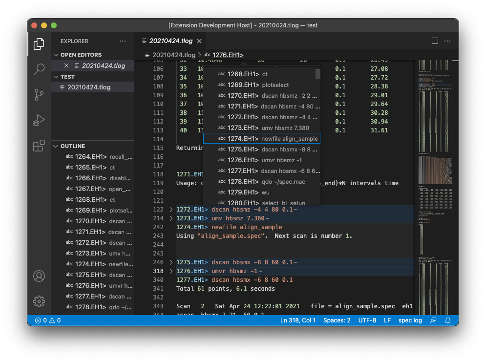

# __spec__ Log File Support for Visual Studio Code

The extension is designed to assist users in browsing __spec__ log files with Visual Studio Code.
The term _log files_ here indicates files created by the __spec__ software when it is launched with `-l` option (e.g., `fourc -l 20210414.tlog`).

__spec__ does not specify a filename extension for log files.
While this extension by default treats `.tlog` as the file extension for log files (language identifier: `spec-log`), users can change the association by themselves.
Read [Language Support in Visual Studio Code](https://code.visualstudio.com/docs/languages/overview) (official document of VS Code) for further details.

<!-- https://github.com/fujidana/vscode-spec-log/raw/master/resources/screenshot.png -->

## Features

* __Syntax highlighting__: Colorize Lines of prompts, numbers, etc.
* __Code navigation__ : Mark prompts such as `1.FOURC>` and scan header lines such as `Scan  6  Sat Apr 24 ...` for navigation and listed in the breadcrumbs.
  * __Show all symbol definitions within a document__
* __Code folding__ : Make lines between two prompts and continous lines of numbers or time foldable.
* __Display Scan Data in Graph__ : Show a link above a scan header line to open a preview of the scan data. "spec data" extension (`fujidana.spec-data`) is required to use this feature.
* __Document links__ : Make a file path in a scan header a clickable link. Relative paths are resolved from the workspace folder, not the log file.

## What's __spec__?

> __spec__ is internationally recognized as the leading software for instrument control and data acquisition in X-ray diffraction experiments.
> It is used at more than 200 synchrotrons, industrial laboratories, universities and research facilities around the globe.

_cited from [CSS - Certified Scientific Software](https://www.certif.com) homepage._

Note that the extension is not the official one developed by Certified Scientific Software.
Use [GitHub issues](https://github.com/fujidana/vscode-spec-log/issues) for bug reports and feature requests about the extension.

## Tips

The extension sets _level-2_ folding ranges on lines between __spec__ prompts.
"Fold Level 2" and "Unfold All" system-wide commands are useful to control the visibility of the output for the prompts.
These commands have default keyboard shortcuts, `Ctrl+K` `Ctrl+2` (`Cmd+K` `Cmd+2` for macOS) and `Ctrl+K` `Ctrl+J` (`Cmd+K` `Cmd+J` for macOS), respectively.

## Known Issues

See [GitHub Issues](https://github.com/fujidana/vscode-spec-log/issues).

## Release Notes

See [CHANGELOG.md](CHANGELOG.md).

## Contributing

The extension is open to contributions. Create an issue in [GitHub Issues](https://github.com/fujidana/vscode-spec-log/issues) for a bug report or a feature request. If you want to contribute code, please read [CONTRIBUTING.md](CONTRIBUTING.md).
