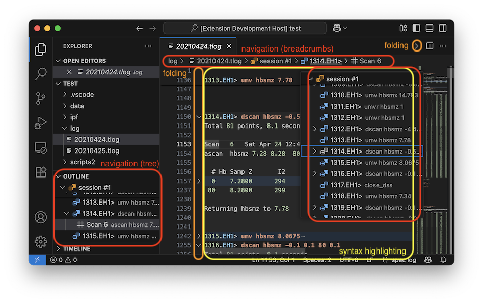

# __spec__ Log File Extension for Visual Studio Code

The extension enhances user experiences in browsing log files __spec__ software outputs after __spec__ is launched with `-l logfile` option.

The default file extention of __spec__ log files is `.tlog` but VS Code provides ways for a user to change the association.
Check VS Code official documents for further details.

## What's __spec__?

> __spec__ is internationally recognized as the leading software for instrument control and data acquisition in X-ray diffraction experiments.
> It is used at more than 200 synchrotrons, industrial laboratories, universities and research facilities around the globe.

_cited from [CSS - Certified Scientific Software](https://www.certif.com) homepage._

Note that the extension is not the official one developed by Certified Scientific Software.
<!-- Use [GitHub issues](https://github.com/fujidana/vscode-spec/issues) for bug reports and feature requests about the extension. -->

## Features

* __Syntax highlighting__
* __Code navigation__
  * __Show all symbol definitions within a document__
* __Code folding__

Lines of a __spec__ prompt such as `1.FOURC>` are picked out for code navigation and folding.

## Requirements

None.

## Extension Settings

None.

## Known Issues

Nothing known.
